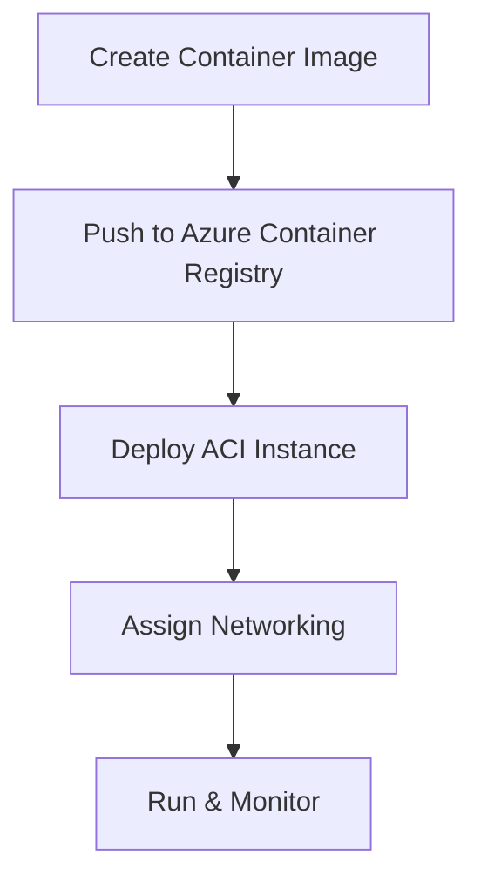

## **Chapter 9: Azure Container Instances (ACI)**

Azure Container Instances (ACI) provide a **serverless** way to run **Docker containers** in Azure without managing virtual machines. It is an ideal solution for **quick deployment, event-driven workloads, and testing containerized applications**.

---

### **1. What is Azure Container Instances (ACI)?**
Azure Container Instances allow you to **run containers directly** in the cloud with **no need for infrastructure management**. Unlike Kubernetes, ACI is designed for **single-container applications** or lightweight workloads.

#### **Key Features:**
✅ **Fast Deployment** → Spin up containers in seconds without VM provisioning.  
✅ **Serverless** → No need to manage infrastructure. Pay only for the container runtime.  
✅ **Supports Linux & Windows Containers** → Choose the OS for your containerized app.  
✅ **Public & Private Networking** → Expose your container with a public IP or keep it internal.  
✅ **Persistent Storage** → Mount **Azure File Shares** for data persistence.  

#### **Use Cases:**
- Running **microservices** without managing Kubernetes.
- **Testing** and developing containerized applications.
- Event-driven applications that **scale on demand**.
- Running **scheduled batch jobs** inside containers.

---

### **2. How Azure Container Instances Work**

1. **Deploy a Container Image**: Pull an image from **Docker Hub, Azure Container Registry (ACR), or a private registry**.
2. **Define Resource Limits**: Set **CPU and Memory** allocation for the container.
3. **Configure Networking**:
   - Assign a **public IP** for external access.
   - Use **private networking** for internal services.
4. **Run & Scale**: The container runs until **stopped or scaled**.

#### **Example Workflow:**

---

### **3. Deploying an Azure Container Instance**
You can deploy an ACI container using **Azure Portal, CLI, or ARM Templates**.

#### **Step-by-Step Guide (Azure Portal)**
1. **Navigate to Azure Portal** → Search for **Container Instances**.
2. **Click "Create"** and provide details:
   - **Subscription & Resource Group** → Select or create a new one.
   - **Container Name** → Give your container a unique name.
   - **Region** → Select a preferred Azure region.
   - **Image Source** → Use Docker Hub (`nginx` as an example) or ACR.
3. **Configure CPU & Memory** → Example: `1 vCPU, 1.5 GB RAM`.
4. **Set Networking** → Choose between:
   - **Public IP** → Exposes the container via a unique URL.
   - **Virtual Network** → Restrict access within a private network.
5. **Review & Deploy** → Click **Create** to launch the container.

---

### **4. Azure Container Instances vs. Other Azure Services**

| **Feature**         | **Azure Container Instances (ACI)** | **Azure Kubernetes Service (AKS)** | **Azure App Service (Containers)** |
|--------------------|---------------------------------|---------------------------------|---------------------------------|
| **Use Case**       | Quick, lightweight container runs | Orchestration for large-scale apps | Host web apps in containers |
| **Scalability**    | Manual or event-based scaling  | Auto-scaling with Kubernetes   | Built-in auto-scaling        |
| **Infrastructure** | No infrastructure management  | Full Kubernetes control       | Managed PaaS environment     |
| **Best For**      | Testing, batch jobs, microservices | Complex, large-scale applications | Web & API hosting          |

---

### **5. Real-World Example**
A **retail company** uses ACI to process images uploaded by customers. When a new image is uploaded to **Azure Blob Storage**, an **event triggers** an ACI container that **resizes and optimizes the image** before saving it back to storage. This eliminates the need for a VM or Kubernetes cluster for a simple, **event-driven task**.

---

### **6. Hands-On Project: Deploy a Container in ACI**
📌 **Project-3: Deploying Azure Container Instances**  
🔗 [View the Full Project Guide](https://github.com/anup-cloudguru/AZ900-Learning-HandsOn-Labs/tree/main/Projects_HandsOn/Project-3_Azure-Container-Instances.md)  

**Hands-on Activities Covered:**
✅ Deploy an **NGINX container** in ACI.  
✅ Assign a **public IP** and access the container.  
✅ Configure CPU/memory allocation.  
✅ Monitor container logs via **Azure Portal & CLI**.  

---

### **7. Summary**
✔ **Azure Container Instances (ACI)** → Fast, serverless container deployment.  
✔ **No infrastructure management** → Just deploy and run your containerized workloads.  
✔ **Ideal for microservices, testing, and batch jobs**.  
✔ **Use ACI when Kubernetes is overkill!**  

---

### **8. Next Steps**
*"In **Chapter 10: Azure Functions**, we will explore **serverless computing** and how to run code without managing servers!"* 🚀
