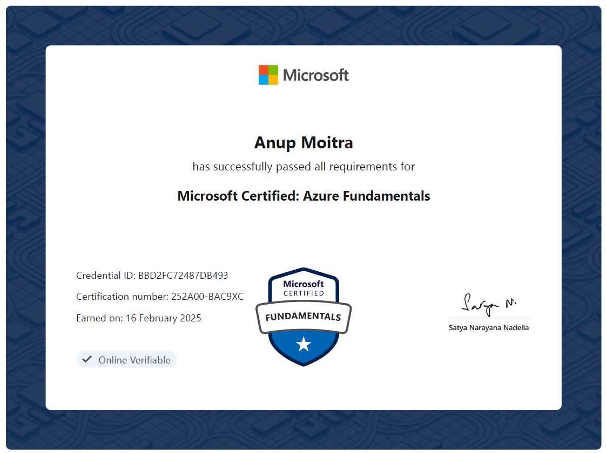

# **AZ-900 Learning & Hands-On Labs** 🚀  

Welcome to the **AZ-900 Learning & Hands-On Labs** repository! This repository provides structured learning materials and practical hands-on labs to help you prepare for the **Microsoft Azure Fundamentals (AZ-900) certification**.  

---

## 📚 **Table of Contents**  
### **1️⃣ AZ-900 Learning Modules**  
📖 **Theoretical Concepts:**  
- [01 - Introduction to Cloud Computing](01-introduction-to-cloud-computing.md)  
- [02 - Cloud Deployment Models and Benefits](02-cloud-deployment-models-and-benefits.md)  
- [03 - Azure Resource Hierarchy](03-azure-resource-hierarchy.md)  
- [04 - Azure Portal Navigation & Free Account Setup](04-azure-portal-setup.md)  
- [05 - Azure Regions and Availability Zones](05-azure-regions-availability-zones.md)  
- [06 - Azure Virtual Machines](06-azure-virtual-machines.md)  
- [07 - Azure VM Scale Sets & Availability Sets](07-azure-vmss-availability-sets.md)  

### **2️⃣ Hands-On Projects**  
💻 **Practical Labs to apply learning:**  
- [Project-1: Azure Account Setup](Projects_HandsOn/Project-1_Azure-Account-Setup.md)  
- [Project-2: Deploying & Scaling Azure VMs](Projects_HandsOn/Project-2_Deploying-Scaling-Azure-VMs.md)  

### **3️⃣ Additional Resources**  
📂 **Supporting Files:**  
- [00 - Essential Cloud & Azure Terms](00-glossary.md)  
- [Images](images/)  

---

## 🎯 **What You Will Learn?**  
✅ Understand Azure fundamentals and cloud concepts  
✅ Learn how to set up an Azure account and navigate the Azure portal  
✅ Deploy, manage, and scale Azure Virtual Machines  
✅ Explore high availability concepts like Availability Zones, Availability Sets & VM Scale Sets  
✅ Gain **hands-on experience** with real-world **Azure projects**  

---

## 🚀 **Getting Started**  
### **Step 1: Learn Theoretical Concepts**  
📖 Read through the **AZ-900 learning modules** to understand core concepts.  

### **Step 2: Practice Hands-On Labs**  
💻 Follow the **step-by-step hands-on projects** to apply what you learn in a real Azure environment.  

### **Step 3: Track Progress & Revise**  
✅ Use the glossary for quick reference  
✅ Review previous chapters before moving ahead  

---

## 🎓 **Certification Achieved**  
✅ Successfully cleared **Microsoft Certified: Azure Fundamentals (AZ-900)** 🎉  

📜 **Certificate Preview:**  
  

📥 **Download Certificate (PDF):**  
🔗 [AZ-900 Certificate PDF](Certificate/AZ-900_Certificate.pdf)  

---

## 🤝 **Contributing**  
We welcome contributions! If you’d like to improve this repository:  
- Fix typos, improve explanations, or add diagrams  
- Submit a **Pull Request (PR)** with changes  

---

## 📜 **License**  
This repository is licensed under the **MIT License**. See [LICENSE](LICENSE) for details.  

---

## 🎯 **Next Steps**  
- 🌐 Explore **Microsoft Learn** modules for AZ-900  
- 📝 Take practice tests for **certification readiness**  
- 📢 Share your progress using `#AZ900WithPiyush` on **LinkedIn/Twitter**  

---

💡 **Happy Learning & Best of Luck for AZ-900!** 🎉🚀
